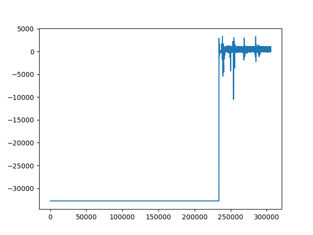

# MOVER Waveform Cleaning

This is the code repo for cleaning MOVER waveform data. The decode function is from the 'waveform_decode.py' file in the original MOVER data repo 

## Issues

1. Lack of data dictionary about waveform types. What's the difference between 'ECG1' and 'GE_ECG'?
2. Some samples have inconsistent waveforms. The half of 'ECG1' is a straight line, for example (id=696793e068608e7c)

Another example is 'GE-ECG', while the first and second half of waveform have different scales.

